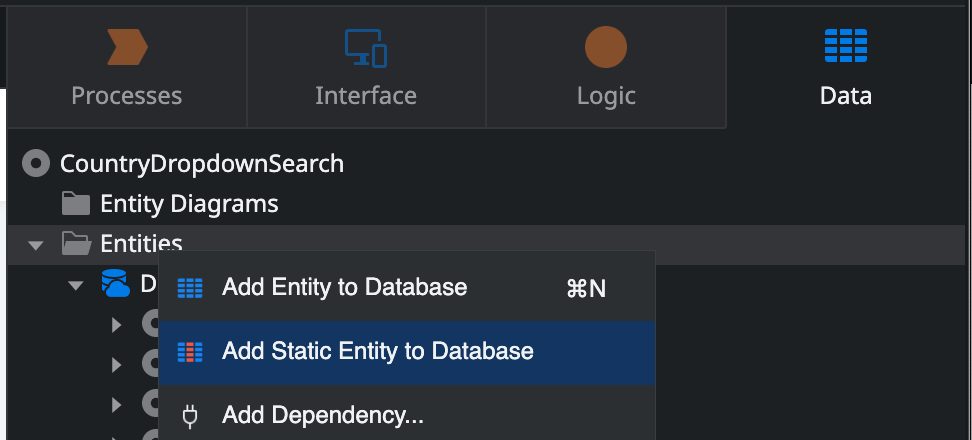
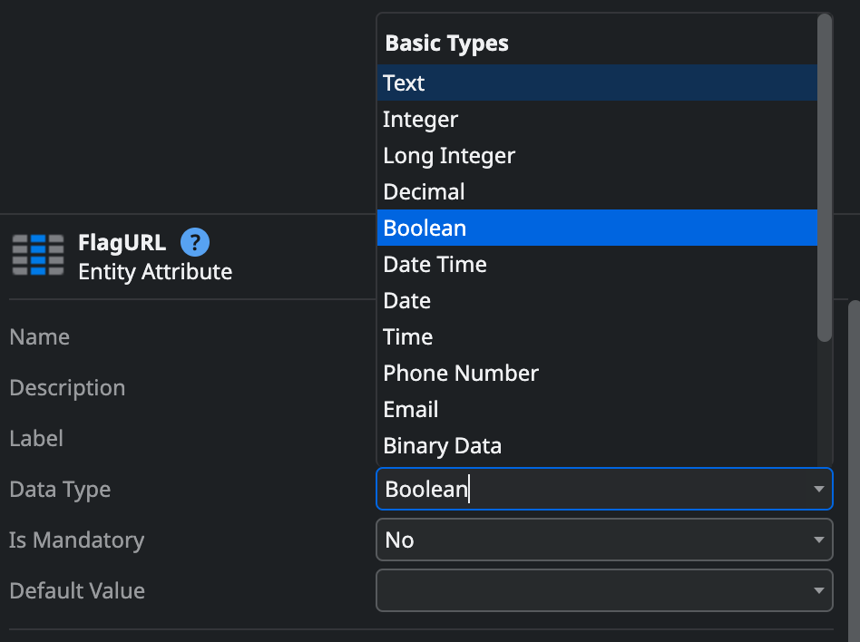
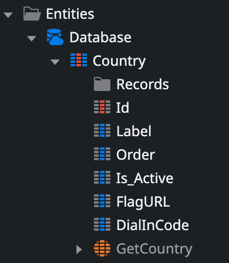
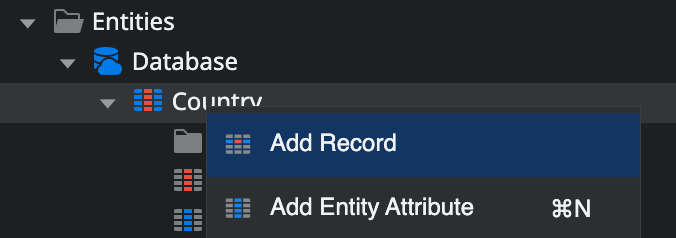
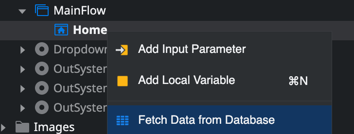
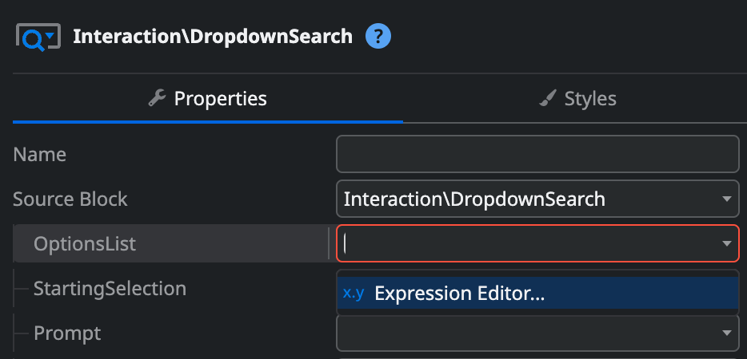
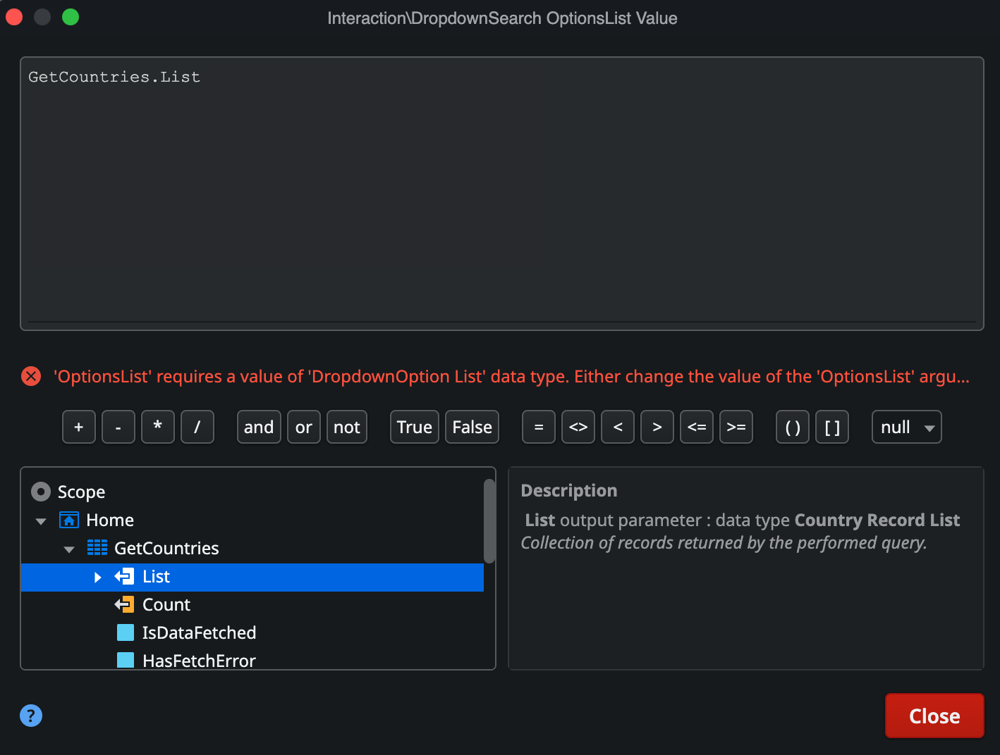
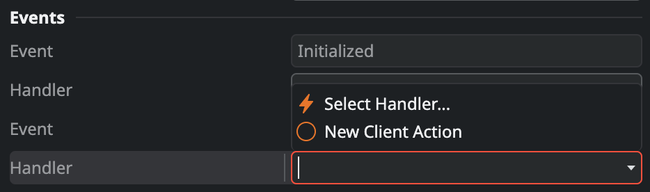

# How to implement a dropdown search with country dial-in codes and flags

This article describes how to implement a dropdown with country dial-in codes and flags using [OutSystems UI Patterns](https://outsystemsui.outsystems.com/OutSystemsUIWebsite/PatternOverview). In this article we will develop the pattern from scratch, some steps can be skipped by using components in the OutSystems Forge, more on this at the end of this guide.

To do this task, we will need to perform these steps:
1. Setup the list of countries with flags and dial-in codes
1. Display the data in a dropdown search to offer a better user experience 

To setup the list of countries, follow these steps:
1. From **Service Studio**, go to the **Data** tab, right-click the **Entities** folder and select **Add Static Entity to Database**.



1. Rename the entity to Country
1. Right-click the Country static entity and select **Add Entity Attribute** and name it FlagURL
1. In the attribute properties pane, click the **Data Type** dropdown and change it to **Text**
1. Still in the same pane, change the **Length** of value from 50 to 150



1. Add a new entity attribute, name it DialInCode and set it's data type to **Integer**. This is the expected outcome:



Now it's time to add data to our static entity:
1. Right-click the newly created **Static Entity** and select **Add Record**



1. Name the new record USA
1. Fill in the record attributes with the following data:
    1. **Label**: United States of America
    1. **FlagURL**: Wikipedia could be a good source for the flag image url. In this case: <https://upload.wikimedia.org/wikipedia/en/thumb/a/a4/Flag_of_the_United_States.svg/16px-Flag_of_the_United_States.svg.png>
    1. **DialInCode**: 1

To create an empty screen, follow these steps:
1. Go to the **Interface** tab and expand the **UI Flows** folder.  
1. From the **UI Flows** folder, select **MainFlow** > **Add Screen**.  
1. In the **New Screen** window, select **Empty** to display a preview of the empty screen.
1. Select **Create Screen** 

To get the data from the static entity, follow these steps:
1. Right-click the newly created screen and select **Fetch Data from Database**
1. Click the empty space in the opened aggregate
1. Select the Country static entity



To use the dropdown search pattern, follow these steps:
1. Double-click the newly created screen in the **Elements** tree, to open the WYSIWYG view in Service Studio
1. In the left panel, search for "dropdown"
1. Drag and drop the **Dropdown Search** widget to the **Main Content** in the screen canvas

To use the created data in the dropdown search, follow these steps:
1. Click the dropdown search widget in the screen
1. In the properties panel, in the right-side, click the **OptionsList** dropdown and select **Expression Editor**



1. In the expression editor dialog, go to the list of elements in Scope
1. Expand the **GetCountries** aggregate and double-click the **List** element to select it



1. Click the **Close** button

To map the data in the aggregate to what will be shown in the dropdown, follow these steps:
1. In the dropdown search properties panel, in the right side, fill in the values:
    1. **Value**: Country.Id
    1. **Label**: ```"(+" + Country.DialInCode + ") " + Country.Label```
    1. **ImageUrlOrIconClass**: Country.FlagURL 
1.  In the **Events** section of the properties panel, click the **Handler** dropdown and choose **New Client Action**


1. Publish the module

## A few considerations ##
The default look of the icons in the dropdown is circular. In this specific case, we are dealing with flags that in their majority are rectangular which can make the images feel low quality.

To change the aspect of the icons in the dropdown, follow these steps:
1. In the **Interface** tab, expand the **Themes** folder and double-click the already available theme
1. Add the following CSS to the theme 
``` 
.osui-dropdown-option-image {
    border-radius: 0;
    background: none;
    height: 16px;
    width: 16px;
} 
```

## Getting Forge components to the rescue ##
As said, in the beginning of the article, we could skip some steps with the help of a few Forge components. Here's how:
> Please bear in mind that none of these components are supported by OutSystems
- Get the list of all existing countries and dial-in codes:
    - [Geo](https://www.outsystems.com/forge/component-overview/439/geo)
    - [Location](https://www.outsystems.com/forge/component-overview/906/location)
    - [Countries](https://www.outsystems.com/forge/component-overview/7931/countries)
- Get countries and its flags
    - [Flags Services](https://www.outsystems.com/forge/component-overview/14259/flags-services)
    - [Country Flags](https://www.outsystems.com/forge/component-overview/11309/country-flags)
    - [Countries Flags](https://www.outsystems.com/forge/component-overview/12668/countries-flags)